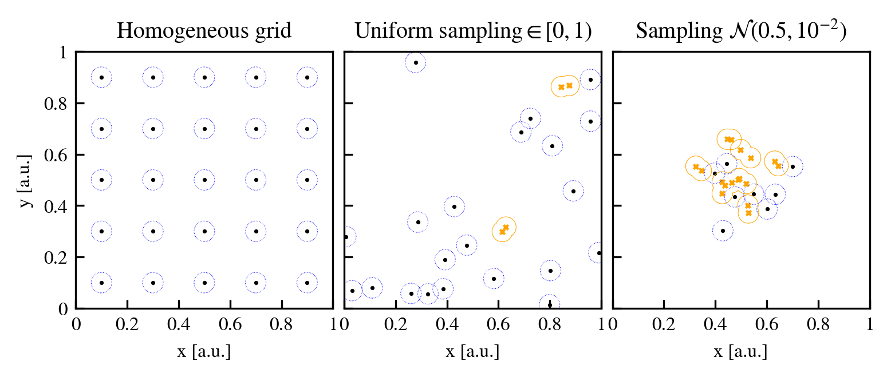

# Input halo catalogue

The history-based approach of HBT-HERONS works by identifying subhaloes as they form in isolation, i.e. when they are field haloes. Therefore, an essential input required by HBT-HERONS are which particles in each output belong to field haloes. Although the definitions of what a field halo is differ across algorithms, a very commonly used method to identify them is through the [Friends-of-Friends](#friends-of-friends) (FoF) algorithm.

HBT-HERONS uses the FoF group catalogue in each output to

*   Spawn new subhaloes if a FoF group does not already have one.
*   Idenfity when previously-existing subhaloes are in the same FoF group, in which case the new central subhalo needs to be identified.
*   Allow the mass accretion of diffuse mass onto central subhaloes.

## Friends-of-Friends

The Friends-of-Friends algorithm links particles which are within a certain distance threshold ($l_{\rm FoF}$) from each other, forming a group of "friend particles", each of which is also connected to their own group of friend particles. A FoF group is therefore constituted by all particles that are within a distance of $l_{\rm FoF}$ from at least one particle in the same group.

The FoF linking length is a free parameter that is typically chosen to be proportional to a characteristic scale of the system being analysed. For the purposes of finding haloes, which are made up by particles living in overdense regions, the linking length is a fraction (generally 0.2) of the mean interparticle spatial separation. This means that particles that are closer than the typical expected separation of particles will be linked by the FoF algorithm.

We provide two examples that illustrate how this works in practice, one being an [illustrative 2D case](#2d-example), and another one taken directly from a [cosmological simulation](#cosmological-example).

#### 2D example

We place $5^2$ particles on a 2D region without periodic boundary conditions and a length per axis of one arbitrary unit. We place particles according to three different sampling strategies:

*   A uniform grid, which corresponds to a completely homogenous density distribution.
*   Randomly sampling uniformly from the open interval $[0,1)$
*   Randomly sampling from a narrow Gaussian distribution ($\mathcal{N}$) placed at the centre of the domain.

 The mean interparticle length in all three cases is $\langle l \rangle = 5^{-1}$ in arbitrary units. Using a factor of 0.2 times the mean interparticle separation, as used in cosmological simulations, results in $l_{\rm FoF} = 0.04$ arbitrary units. This linking length is illustrated using a blue circle around each individual particle that is not part of any FoF group, which are represented as black circles. Particles which are paired up with at least one neighbour are represented as orange crosses and have an orange outline that delineates the combined linking length envelope of the FoF group.

No FoF groups form in the homogenous grid, since there are no overdensities. Some FoF groups are present in the second configuration, simply due to the discrete nature of the particle sampling. These connections may be deemed as *spurious*, since they do not trace an underlying physical structure. In the last example, we see larger groups forming that roughly coincide with the peak of the Gaussian distribution. However, not all particles are connected, leading to the *fragmentation* of the Gaussian peak into several groups.

<figure markdown="span">
{ width="1000" }
</figure>

#### Cosmological example

The FoF linking length used to analyse cosmological simulations is normally a fraction of the *mean dark matter interparticle separation*, $l_{\rm DM}$. This means that for dark-matter-only simulations $l_{\rm DM}$ equals the mean interparticle separation, but it does not for hydrodynamical simulations:

$$
l_{\rm DM} = \sqrt{\dfrac{m_{\rm DM}}{\Omega_{\rm DM}\rho_{\rm crit}}}\,,
$$
where $m_{\rm DM}$ is the dark matter particle mass, $\Omega_{\rm DM}$ the dark matter density parameter (excluding neutrinos) and $\rho_{\rm crit}$ the critical density of the universe.

Based on the spurious connections present in the random particle distribution of our [2D example](#2d-example), a minimum particle limit is usually imposed on the FoF group catalogues. It is chosen to be $\mathcal{O}(10)$ and typically larger than 20 particles, which is sufficient to remove most spurious connections that happen by fly-bys of nearby particles.

Since the universe is very homogenous at early times, no overdensities are large enough within the simulation to be identified by the FoF algorithm. As the universe evolves, overdensities grow in amplitude and result in particles bunching up together and creating a FoF group. Consequently, no FoF groups exist at early enough times but they continously form and grow as the simulation progresses.

Below is a video of the formation of an isolated field halo, as traced out by a FoF group, starting from the initial conditions of a dark-matter-only simulation. The left panel shows the dark matter surface density centered on the forming field halo. The right panel shows the 3D position of particles within a cubic region of the halo. Particles within the chosen FoF link are connected by lines, but only one FoF group ever grows above our chosen threshold of 32 particles. The particles that belong to this FoF group are coloured blue.

