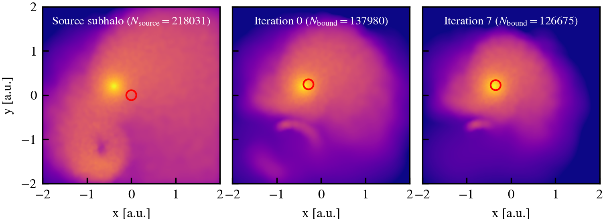
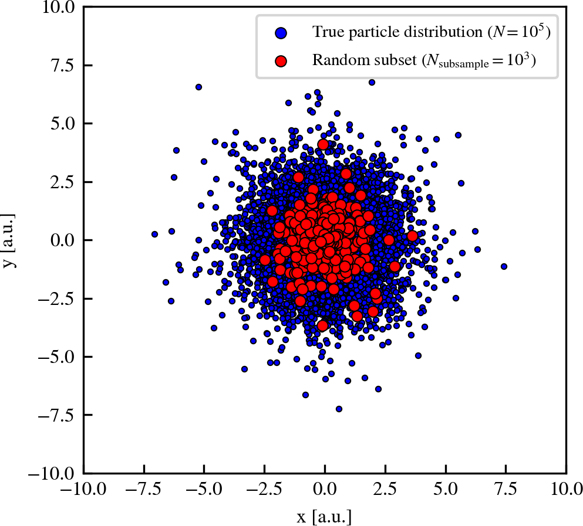
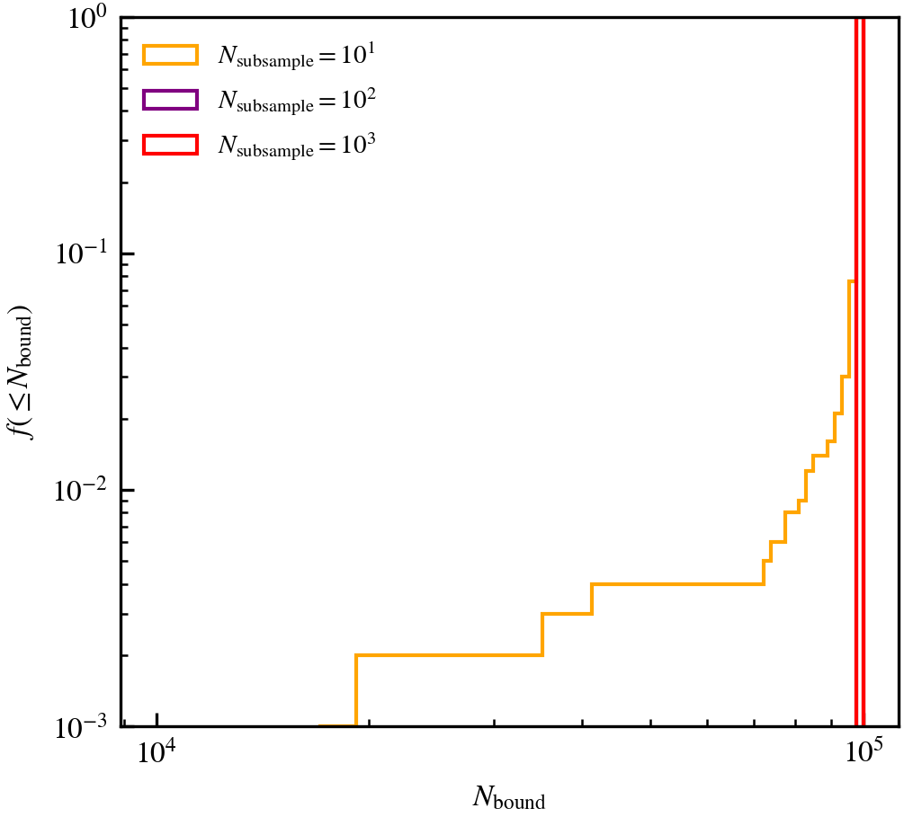

# Unbinding

## Binding energies

For the purposes of unbinding, subhaloes in HBT-HERONS are treated as if they were isolated in the universe. This means that nearby mass not explicitly associated to the subhalo does contribute to the gravitational potential calculations. In fact, only the gravitational potential of bound particles is included. These two approximations are commonly used in other structure finding codes, although some relax these assumptions.

A particle $i$ is bound if its binding energy, which is the sum of its kinetic ($K_{i}$) and potential ($U_{i}$) energy in the subhalo centre-of-mass reference frame, is negative:

$$
E_{\mathrm{bind},i} = K_{i} + U_{i} < 0.
$$

For hydrodynamical simulations, the user can optionally include the internal energy of gas particles in the definition of binding energies ([`HBT_UNBIND_WITH_THERMAL_ENERGY`](../installation.md#type-of-simulation)). Note that there are certain choices about which specific particles contribute in the calculations of potential energy and the centre-of-mass reference frame. We explain each of them below.

<h4>Centre of mass</h4>

The centre of mass position and velocity of the subhalo only uses bound particles:

$$
\vec{v}_{\rm com} = \dfrac{\sum \vec{v}_{i}m_{i}\theta_{\rm H}(1 - E_{\mathrm{bind},i})}{\sum m_{i}\theta_{\rm H}(1 - E_{\mathrm{bind},i})} \; \;\; \;\mathrm{and}  \; \;\; \; \vec{x}_{\rm com} = \dfrac{\sum \vec{x}_{i}m_{i}\theta_{\rm H}(1 - E_{\mathrm{bind},i})}{\sum m_{i}\theta_{\rm H}(1 - E_{\mathrm{bind},i})}.
$$

The Heaviside step function ($\theta_{\rm H}$) ensures that only bound particles contribute to the sum.

<h4>Kinetic energy</h4>

The kinetic energy of a particle is defined in the centre of mass frame of the subhalo, which includes the Hubble flow velocity component if it is a cosmological simulation:

$$
K_{i} = \dfrac{1}{2}m_{i}|(\vec{v}_{i} - \vec{v}_{\rm com}) + H(\vec{x}_{i} - \vec{x}_{\rm com})|^{2}.
$$

<h4>Potential energy</h4>

The potential energy is the potential energy generated by bound particles in the subhalo:

$$
U_{i} = \sum_{j}\dfrac{Gm_{i}m_{j}\theta_{\rm H}(1 - E_{\mathrm{bind},j})}{|\vec{x}_{i} - \vec{x}_{j}|^{2}}.
$$

Again, the Heaviside step function ensures that only bound particles contribute to the potential calculations.

## Iterative unbinding

As explained above, several of the properties required to check whether particles are bound (e.g. centre of mass position and velocity) require knowing which particles are bound. But how do we know *a priori* which particles are bound, and hence which particles contribute to the above sums? The answer is that we need to start with an initial guess.

HBT-HERONS starts by assuming that all particles in the source subhalo are bound. Although this may be a crude guess, particularly when the subhalo is quickly losing bound mass, one can determine the binding energies of particles and hence which ones are bound. This more sensible set of bound particles is then used again to further refine the centre-of-mass reference frame, gravitational potential and hence binding energies.

In fact, one can keep on repeating the refinement steps until one or more thresholds are satisfied. In HBT-HERONS, these are:

* The subhalo contains fewer total or tracer particles than a value ([`MinNumPartOfSub`](../running/parameter_file.md#tracking) or [`MinNumTracerPartOfSub`](../running/parameter_file.md#tracking)), in which case it is classified as disrupted.
* The number of bound particles between two subsequent unbinding iterations has converged to within a threshold ([`BoundMassPrecision`](../running/parameter_file.md#unbinding)).

<h4>Stripped subhalo example</h4>

We illustrate below how the iterative unbinding works for a subhalo that has already undergone successive pericentric passages around a spherically symmetric potential. Each panel shows the mass surface density of either the source subhalo (leftmost panel) or the bound mass as identified in the first (center panel) and last (rightmost panel) unbinding iterations. The red circle in each panel indicates the centre of mass position computed from the particles shown in each panel. The field of view is centred on the centre of mass of the source subhalo.

<figure markdown="span">
{ width="1000" }
</figure>

We see that in this example, the source subhalo contains a large amount of unbound mass. The large amount of unbound mass is caused by the stripping of mass from the subhalo by the central potential. This is the reason why the source subhalo is spatially extended and contains stream-like features. From this we see that assuming that the source subhalo is entirely bound can be crude, and the estimated centre of mass of the system is offset from the true density peak. However, even after a single iteration of unbinding, the centre of mass moves towards the true density peak of the subhalo and removes most unbound particles. Subsequent iterations serve to further refine the centre and the bound set of particles.

The fact that the source subhalo becomes increasingly dominated by unbound particles as subhaloes experience tidal stripping can have important implications when identifying the bound component of resolved subhaloes. Unbound particles have velocities larger than the escape velocity of the system, so the estimated centre of mass velocity will be large relative to the velocity of the true centre of the subhalo. Moreover, because of the Hubble flow, the spatial offset between the estimated centre of mass and the true centre of the subhalo will further overestimate the kinetic energy of the particles within the subhalo core. To avoid a catastrophic case where a resolved subhalo is misidentified as disrupted, HBT-HERONS limits the source subhalo to have a maximum size relative to the bound component of subhalo ([`SourceSubRelaxFactor`](../running/parameter_file.md#unbinding)).

## Particle subsampling

The process of unbinding is generally the most expensive part of finding subhaloes in simulations, unless you analyse a large cosmological box with relatively poor mass resolution (I/O limited). Not only do you need to compute the gravitational potential of all bound particles, but you also need to do so for (potentially) many unbinding iterations.

To speed up unbinding, HBT-HERONS restricts the number of particles that are gravity sources to a user-defined maximum quantity   ($N_{\rm subsample}$; [`MaxSampleSizeOfPotentialEstimate`](../running/parameter_file.md#unbinding)). If the number of particles in the source subhalo is greater than the chosen threshold, a subsample of $N_{\rm subsample}$ particles is chosen at random. Only the chosen particles contribute to the gravitational potential energy, with all other particles acting as test particles of the gravitational potential field. The mass of the randomly chosen subset of individual particles is scaled to ensure mass conservation.

Note that there are additional options that can refine the way in which the random subsampling occurs. For example, the subsampling of specific particle types (e.g. black holes) can be explicitly disabled. Moreover, the scaling of particle masses can be done on a per-particle-type basis, which is recommended if particle types are spatial distributed in very different ways with respect to each another.

We show below how the subsampling of particles works in practice, and how it may bias results compared to not subsampling, using an idealised subhalo.

<h4>Isolated subhalo example</h4>

We generate a spherically symmetric subhalo in isolation and equilibrium using $N = 10^{5}$ particles. Since the number of particles is above the default threshold of $N_{\rm subsample} = 10^{3}$, we randomly select $10^{3}$ particles. The projection of the true (blue dots) and subsampled (red dots) spatial distributions are shown below.

<figure markdown="span">
{ width="600" }
</figure>

We can visually see that the distribution of randomly chosen subset of particles *approximately* follows the underlying ground truth. The extent is however different, and regions with few particles become prone to shot noise as we reduce the number of points representing the mass distribution. These problems exacerbate as the chosen value of $N_{\rm subsample}$ decreases, since you become increasingly reliant on whether your random choice of particles is representative or not.

However, when we perform the subsampling, we are only interested in speeding up the process of identifying *which particles are self-bound*. Hence, the more appropiate metric of how well subsampling works is to investigate how the number of bound particles   ($N_{\rm bound}$) differs from the ground truth. We show the cumulative distribution of $N_{\rm bound}$ for 1000 different random realisations for $N_{\rm subsample} = 10, 10^{2}$ and $10^{3}$. Since this is an isolated subhalo in equilibrium, all particles should be bound ($N_{\rm bound} = 10^{5}$).

<figure markdown="span">
{ width="600" }
</figure>

For this test, which represents a best case scenario because of the spherical symmetry, we see that using as few as $10^{2}$ particles yields results comparable to using all particles. The only difference is that the amount of calculations has drastically reduced, and hence the computational cost is lower. However, using very few particles ($N_{\rm subsample} = 10$) results in $\approx 8\%$ of cases in an underestimate of the bound mass of the subhalo. The cases where the bound mass is underestimated reflect a random subsample that poorly represents the underlying mass distribution, which becomes more likely to happen as the ratio $N_{\rm bound} / N_{\rm subsample}$ becomes very small.