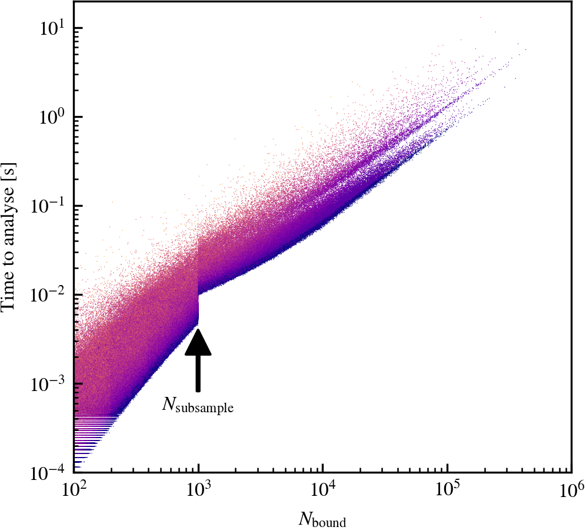
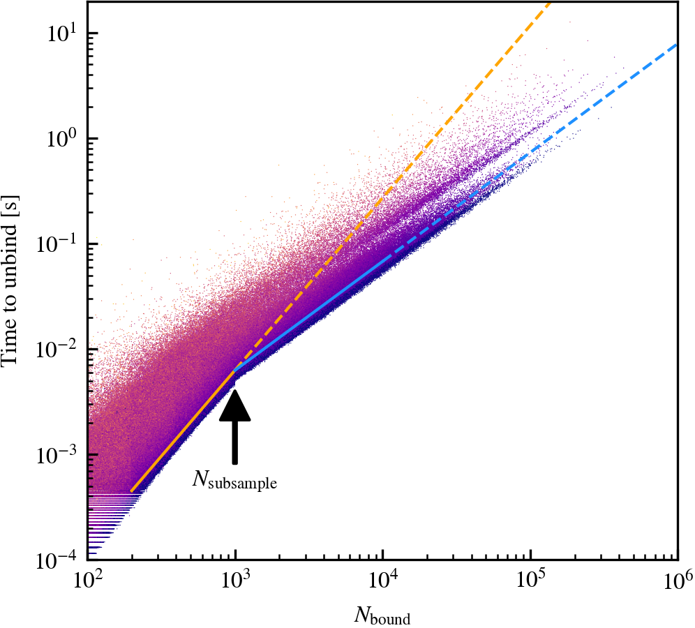
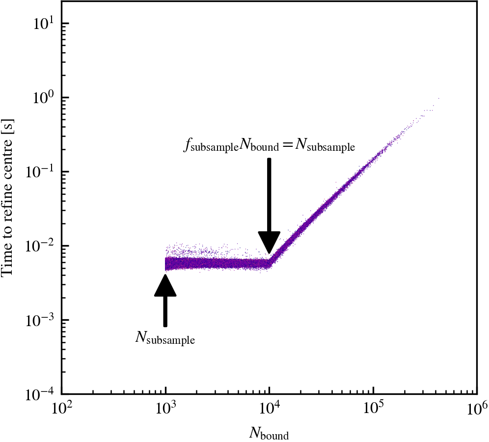

# Timing

## Snapshot-level

HBT-HERONS saves a file to `<SubhaloPath>/timing.log` that lists for each output time how much a given step of the analysis took. Each line corresponds to the timing information for a given output, which are appended to the end of the file, meaning that restarting an analysis will add this information to a pre-existing timing file. Usually, most of the time is spent on either loading the simulation data or unbinding subhaloes.

The following entries, which are measured in elapsed seconds for the slowest MPI rank, are currently saved:

`snap_io`
:   Time taken to load the snapshot particle data.

`snap_exchange`
:   Time taken to send particle data to MPI ranks based on their IDs.

`snap_hash`
:   Time taken to create within each MPI rank a hash table between a particle index and its ID.

`read_snap`
:   Time taken to do all of the snapshot particle data loading and communication tasks.

`halo_io`
:   Time taken to load the Friends-of-Friends data.

`halo_comms`
:   Time taken to communicate Friends-of-Friends data to their assigned MPI rank.

`read_halo`
:   Time taken to do all of the Friends-of-Friends data loading and communication tasks.

`update_halo`
:   If the particles are not loaded together with the Friends-of-Friends catalogue, time taken to update the properties of particles associated to each FoF group.

`update_subhalo`
:   Time taken to update the properties of particles associated to pre-existing subhaloes.

`clean_tracks`
:   Time taken to remove particles from subhaloes that are no longer in the same FoF group as its subhalo.

`assign_hosts`
:   Time taken to assign host FoF groups for pre-existing subhaloes.

`store_tracers`
:   Time taken to store the IDs of the most bound tracer particles of pre-existing resolved subhaloes. Information is later used for identifying descendant subhaloes of disrupted subhaloes.

`prepare_centrals`
:   Time taken to decide which subhaloes are the centrals in each FoF group, and assign the associated FoF group particles to their source subhalo.

`reassign_particles`
:   Time taken to reassign gas particles to different subhaloes based on neighbouring particles. This step only happens if `ReassignParticles = 1`.

`unbind`
:   Time taken to subject all of the subhaloes to unbinding.

`update_tracks`
:   Time taken to assign hierarchical relationships between subhaloes and compute density-profile level properties, e.g. $V_{\rm max}$.

`merger_tree`
:   Time taken to find and retrieve the subhalo membership of particle tracers that used to belong to resolved subhaloes that have just disrupted in this output. This time also includes the time to score and decide their descendant subhaloes.

`write_subhalos`
:   Time taken to save the subhalo catalogues and restart files.

## Subhalo-level

The snapshot-level timing is useful to determine which HBT-HERONS analysis step dominates the runtime. However, even if it tells you that unbinding dominates the runtime, it does not provide enough information to determine the cause. Is it due to a large imbalance across MPI ranks because of the domain decomposition or simply a particularly expensive-to-analyse halo?

To provide further insights into the cost of unbinding, we provide a compile time option (`HBT_MEASURE_UNBINDING_TIME`) that enables the measurement of how long each step within [`Subhalo_t::Unbind`](https://github.com/SWIFTSIM/HBT-HERONS/blob/7fbc6515c2e0d4fba7c7f8e427b396f3d5a6f1d5/src/subhalo_unbind.cpp#L463) takes. When enabled, the subhalo catalogues contain [additional properties](./subhalo_properties.md#analysis-cost-statistics) for each subhalo that allows the user to reconstruct the analysis start time and elapsed time for each subhalo.

<h4>Example</h4>

Below are several plots that illustrate how this data can be used to gain insight into the cost of analysing individual subhaloes, and how it relates to runtime options chosen by the user. The tests we provide were done using the intermediate resolution   ($m_{\mathrm{dm}} = 6.72 \times 10^{9}\,\mathrm{M}_{\odot}$) DMO simulation of the $1\,\mathrm{Gpc}$ box
from the FLAMINGO suite of simulations ([Schaye et al 2023](https://ui.adsabs.harvard.edu/abs/2023MNRAS.526.4978S/abstract)). We use the default code values for runtime parameters.

=== "Complete analysis"

    <figure markdown="span">
    { width="600" }
    </figure>

    Subhalo analysis becomes more expensive as the number of associated particles increases. There is a jump in time when $N_{\rm bound} = N_{\rm subsample} = 10^{3}$, which reflects the overhead associated to the refining the centre of subhaloes. Nonetheless, the dependence between the time to analyse and the number of particles becomes flatter above this threshold compared to $N_{\rm bound} < N_{\rm subsample}$.

=== "Unbinding"

    <figure markdown="span">
    { width="600" }
    </figure>

    Subhalo unbinding becomes more expensive as the number of associated particles increases. A broken power law is well suited for describing the *median* time dependence as a function of $N_{\rm bound}$. Each line indicates the best-fit power law to the median time dependence above and below $N_{\rm subsample} = 10^{3}$, with the dashed range indicating an extrapolation. Below the subsampling threshold, $t_{\rm unbind} \propto N^{1.6}_{\rm bound}$. Once subsampling kicks in, $t_{\rm unbind} \propto N^{1.0}_{\rm bound}$.

=== "Center refinement"

    <figure markdown="span">
    { width="600" }
    </figure>

    Centre refinement is only triggered for subhaloes that have been subsampled, which is why there are no data below $N_{\rm bound} = 10^{3}$. The number of particles that HBT-HERONS uses for centre refinement, $N_{\rm subsample}$, is chosen according to $\max(10^{3}, f_{\rm subsample}N_{\rm bound})$   $= \max(10^{3}, 0.1 \times N_{\rm bound})$. Hence, the time cost is constant up until $N_{\rm bound} = 10^{4}$ particles, and  scales linearly with $N_{\rm bound}$ above this threshold.